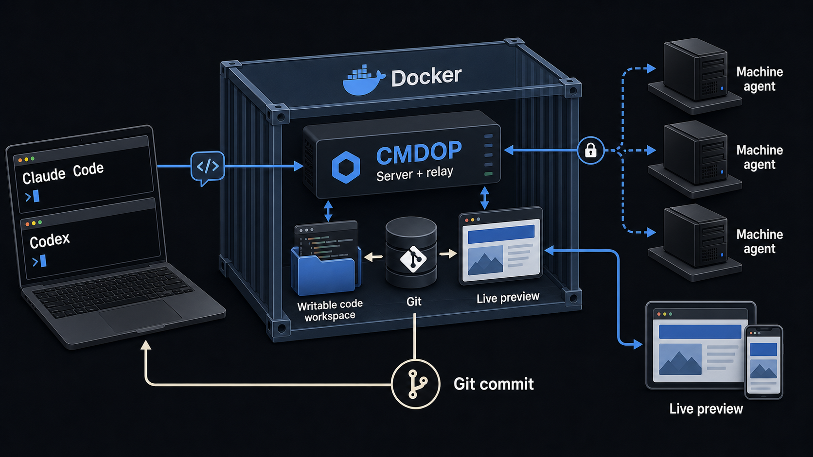

<div align="center">

# CMDOP for Docker

**A live workspace where coding agents edit, preview, and commit real projects.**

[](LICENSE)
[](compose.yaml)
[](https://cmdop.com/products/docker)

[Quick start](#quick-start) | [Inside the stack](#inside-the-stack) | [Documentation](docs/README.md) | [cmdop.com](https://cmdop.com)

</div>



`cmdop-docker` is the fastest way to experience the complete CMDOP loop on your
machine. One Compose service starts the CMDOP server, a scoped machine agent,
an editable project, live browser preview, and persistent Git history.

Use Claude Code, Codex, or another coding agent to request a change. Watch the
result appear in the browser, inspect the files, and keep the finished work as a
normal Git commit.

## What you get

- **A real workspace.** The agent edits the same files you can inspect on the host.
- **Immediate feedback.** Vite HMR updates the browser as the project changes.
- **Bounded access.** The machine agent works inside the configured project directory.
- **Durable history.** Finished changes remain in local Git across container recreation.

The repository provides the Docker setup and editable demo. The CMDOP binary is
installed from the official distribution when the image is built.

## Quick start

You need Docker Engine with Compose v2 and a [CMDOP API key](https://my.cmdop.com).

```bash
git clone https://github.com/commandoperator/cmdop-docker.git
cd cmdop-docker
cp .env.example .env
```

Add the required values to `.env`:

```dotenv
CMDOP_API_KEY=your_api_key
CMDOP_ADMIN_PASSWORD=choose_at_least_12_characters
```

Start the workspace:

```bash
docker compose up --build
```

| Open | Address |
|---|---|
| Live site | [localhost:8080](http://localhost:8080) |
| CMDOP console | [localhost:63141](http://localhost:63141) |

Select the connected machine in the console and try:

```text
Change the hero accent to cobalt blue and rewrite the headline for a robotics
studio. Keep it responsive.
```

## Inside the stack

Three supervised processes form one feedback loop:

| Process | Responsibility |
|---|---|
| CMDOP server | Browser console, authenticated sessions, and relay |
| CMDOP machine agent | Agent access scoped to `/workspace/demo` |
| Vite | Immediate preview of the same writable files |

The host `./demo` directory is mounted at `/workspace/demo`. CMDOP state, Git
history, and `node_modules` use named volumes. Recreating the container keeps the
working state while a rebuild resolves the current CMDOP release.

The relay listener stays container-local by default. The site and console bind
to `127.0.0.1`, and the machine agent connects outbound. The working directory
is set explicitly with `CMDOP_AGENT_CWD`.

To adapt the stack for another project or public deployment, start with
[configuration and persistence](docs/configuration.md) and
[deployment and firewall guidance](docs/deployment.md).

## Documentation

- [Architecture and process supervision](docs/architecture.md)
- [Configuration and persistence](docs/configuration.md)
- [Agent commits and optional GitHub publishing](docs/git-and-github.md)
- [Public deployment, ports, and firewall](docs/deployment.md)
- [Troubleshooting and safe support bundle](docs/troubleshooting.md)

For programmatic Python and Node integrations, see
[`commandoperator/cmdop-sdk`](https://github.com/commandoperator/cmdop-sdk).

## CMDOP ecosystem

[Product](https://cmdop.com) | [CMDOP for Docker](https://cmdop.com/products/docker) | [Documentation](https://docs.cmdop.com) | [SDK](https://github.com/commandoperator/cmdop-sdk) | [Download](https://cmdop.com/download)

## License

The Docker setup and demo project in this repository are licensed under the
[Apache License 2.0](LICENSE). CMDOP itself is distributed under its own product
terms.
