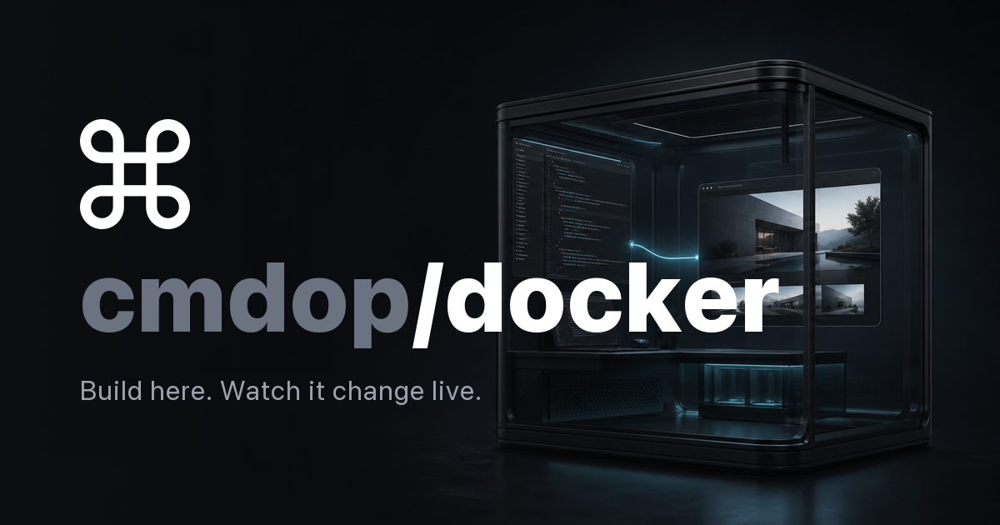

# Cmdop Docker Live Demo



Tell Cmdop what to change. The agent edits the site inside Docker, Vite updates
the browser live, and the finished change is committed automatically.

## Run it

You need Docker Engine with Compose v2.

```bash
cp .env.example .env
# Add CMDOP_API_KEY and a 12+ character CMDOP_ADMIN_PASSWORD to .env
docker compose up --build
```

Open the [live site](http://localhost:8080) and the
[Cmdop console](http://localhost:63141). Sign in, select the connected machine,
and try:

```text
Change the hero accent to cobalt blue and rewrite the headline for a robotics
studio. Keep it responsive.
```

That is the complete setup. There is no site to clone inside Docker, no Git to
install, and no repository to initialize. The container prepares the editable
site and its local Git history automatically. Connecting that history to GitHub
is optional.

## Read more

- [Documentation index and safe support bundle](docs/README.md)
- [How the demo works](docs/architecture.md)
- [Configuration and persistence](docs/configuration.md)
- [Agent commits and optional GitHub publishing](docs/git-and-github.md)
- [Public deployment, ports, and firewall](docs/deployment.md)
- [Troubleshooting](docs/troubleshooting.md)

Apache License 2.0. See [LICENSE](LICENSE).
