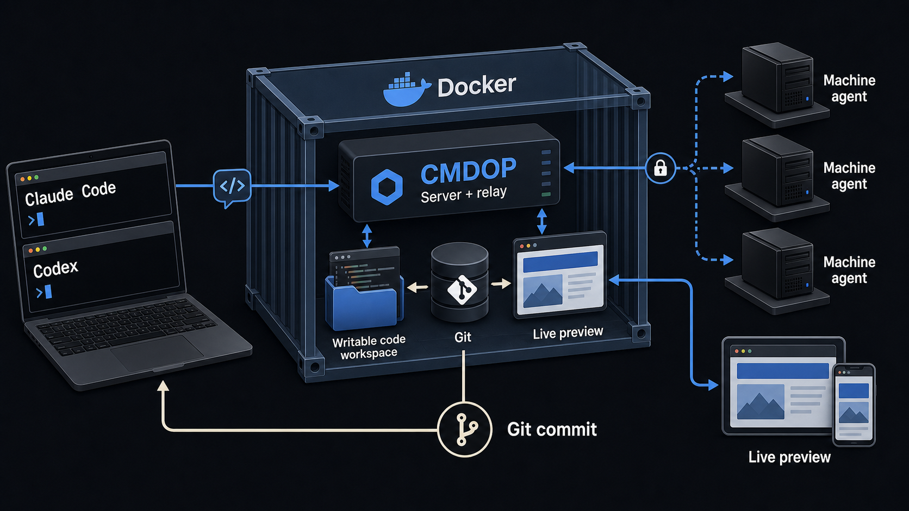

<div align="center">

# CMDOP for Docker

**A live workspace where coding agents edit, preview, and commit real projects.**

[](LICENSE)
[](compose.yaml)
[](https://cmdop.com/products/docker)

[Live demo](https://demo.cmdop.com) | [Quick start](#quick-start) | [Documentation](https://docs.cmdop.com/docs/deployment/docker) | [cmdop.com](https://cmdop.com)

</div>



`cmdop-docker` is the fastest way to experience the complete CMDOP loop on your
machine. One Compose service starts the CMDOP server, a scoped machine agent,
an editable project, live browser preview, and persistent Git history.

Use Claude Code, Codex, or another coding agent to request a change. Watch the
result appear in the browser, inspect the files, and keep the finished work as a
normal Git commit.

**See it running first:** [demo.cmdop.com](https://demo.cmdop.com) is this
repository deployed as-is — the page you land on is the demo project below,
edited by an agent through the same loop you are about to run locally.

## What you get

- **A real workspace.** The agent edits the same files you can inspect on the host.
- **Immediate feedback.** Vite HMR updates the browser as the project changes.
- **Bounded access.** The machine agent works inside the configured project directory.
- **Durable history.** Finished changes remain in local Git across container recreation.
- **Agents included.** Claude Code and Codex are installed and ready to sign in.

The repository provides the Docker setup and editable demo. The CMDOP binary is
installed from the official distribution when the image is built.

## Quick start

You need Docker Engine with Compose v2 and a [CMDOP API key](https://my.cmdop.com).

```bash
git clone https://github.com/commandoperator/cmdop-docker.git
cd cmdop-docker
cp .env.example .env
```

Add the required values to `.env`:

```dotenv
CMDOP_API_KEY=your_api_key
CMDOP_ADMIN_PASSWORD=choose_at_least_12_characters
```

Start the workspace:

```bash
docker compose up --build
```

| Open | Address |
|---|---|
| Live site | [localhost:8080](http://localhost:8080) |
| CMDOP console | [localhost:63141](http://localhost:63141) |

Select the connected machine in the console and try:

```text
Change the hero accent to cobalt blue and rewrite the headline for a robotics
studio. Keep it responsive.
```

## Ask from somewhere other than the console

The agent in this container is reachable from every CMDOP surface, not only the
browser console:

- **The web console** on port 63141 — included, no setup.
- **Telegram, Slack, or Discord** — connect a private bot under **Server → Bots**
  in the console, pair yourself once, then message it directly. See
  [messenger bots](https://docs.cmdop.com/docs/deployment/docker/messaging).
- **The terminal** — `docker compose exec demo cmdop chat`.

## Coding agents

Claude Code and Codex are already installed in the image. Sign in once, with
the subscription you already have — there is no API key to configure, and no
credential of yours goes into this repository:

```bash
make claude-login
make codex-login
```

Each opens its own device-code flow: approve in your browser, paste the code
back. The token is written to the git-ignored `./agents` directory on the host,
which is mounted into the container — so a login survives image rebuilds and
volume resets. Details, including how Codex's sandbox is resolved inside a
container, are in [coding agents](docs/coding-agents.md).

## Inside the stack

Three supervised processes form one feedback loop:

| Process | Responsibility |
|---|---|
| CMDOP server | Browser console, authenticated sessions, and relay |
| CMDOP machine agent | Agent access scoped to `/workspace/demo` |
| Vite | Immediate preview of the same writable files |

The host `./demo` directory is mounted at `/workspace/demo`. CMDOP state, Git
history, and `node_modules` use named volumes. Recreating the container keeps the
working state while a rebuild resolves the current CMDOP release.

The relay listener stays container-local by default. The site and console bind
to `127.0.0.1`, and the machine agent connects outbound. The working directory
is set explicitly with `CMDOP_AGENT_CWD`.

To adapt the stack for another project or public deployment, start with
[configuration and persistence](docs/configuration.md) and
[deployment and firewall guidance](docs/deployment.md).

## Agent mode

The same image can also join an **existing** CMDOP server as one more machine —
no embedded server, no demo, no published ports. Set the target server address
and its fleet join key in `.env` (print the key with `cmdop server join-key`
on the relay host):

```dotenv
CMDOP_SERVER_URL=https://my-team.cmdop.dev
CMDOP_JOIN_KEY=cmdop_enroll_xxxxxxxx
```

Then start the dedicated service:

```bash
docker compose --profile agent up --build agent
```

The container joins on startup and appears in that server's fleet; the host
`./workspace` directory is the agent's working directory. See
[configuration](docs/configuration.md#agent-mode) for details.

## Documentation

Published documentation for this stack lives at
**[docs.cmdop.com/docs/deployment/docker](https://docs.cmdop.com/docs/deployment/docker)**.
The pages in this repository are the operator-level detail behind it:

- [Architecture and process supervision](docs/architecture.md)
- [Configuration and persistence](docs/configuration.md)
- [Claude Code and Codex: login, storage, sandboxing](docs/coding-agents.md)
- [Agent commits and optional GitHub publishing](docs/git-and-github.md)
- [Public deployment, ports, and firewall](docs/deployment.md)
- [Troubleshooting and safe support bundle](docs/troubleshooting.md)

For programmatic Python and Node integrations, see
[`commandoperator/cmdop-sdk`](https://github.com/commandoperator/cmdop-sdk).

## CMDOP ecosystem

[Product](https://cmdop.com) | [Live demo](https://demo.cmdop.com) | [CMDOP for Docker](https://cmdop.com/products/docker) | [Documentation](https://docs.cmdop.com) | [SDK](https://github.com/commandoperator/cmdop-sdk) | [Download](https://cmdop.com/download)

## License

The Docker setup and demo project in this repository are licensed under the
[Apache License 2.0](LICENSE). CMDOP itself is distributed under its own product
terms.
