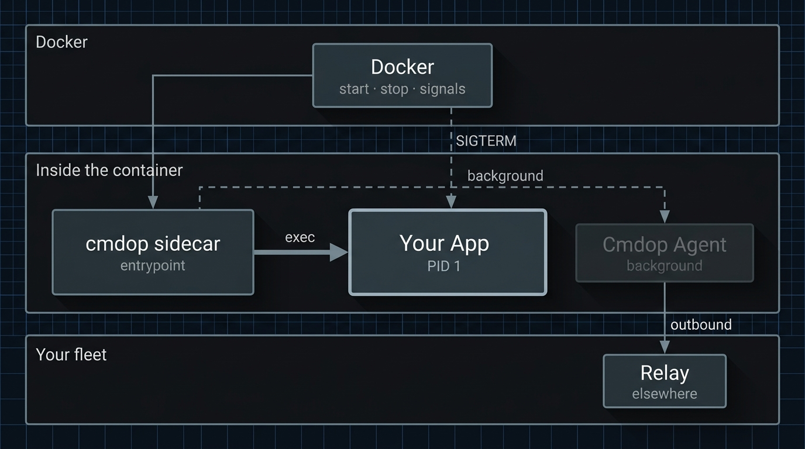

<div align="center">

# Cmdop for Docker

**An AI agent inside the container you already have.**

[](LICENSE)
[](https://hub.docker.com/r/markolofsen/cmdop)
[](https://cmdop.com/products/docker)

[Live demo](https://demo.cmdop.com) | [Documentation](https://docs.cmdop.com/docs/deployment/docker) | [cmdop.com](https://cmdop.com)

</div>



Two lines put a Cmdop agent beside your own application. Your process keeps
PID 1; Cmdop rides along.

```dockerfile
FROM your-image                                    # unchanged
COPY --from=markolofsen/cmdop:latest /cmdop /usr/local/bin/cmdop
ENTRYPOINT ["cmdop", "sidecar", "--"]
CMD ["your-app", "--your", "flags"]                # unchanged
```

Then hand it the fleet's join key:

```bash
docker run -d \
  -e CMDOP_SERVER_URL=https://your-team.cmdop.dev \
  -e CMDOP_JOIN_KEY=cmdop_enroll_xxxxxxxx \
  -e CMDOP_MACHINE_NAME=api-01 \
  -e HOME=/state -v cmdop-state:/state \
  your-image
```

The machine appears in your fleet: terminal, file access, AI chat, remote
execution — from a browser, the CLI, or your phone.

## One binary, and nothing beside it

What you copied in is the whole control plane. The machine agent, the relay
other machines join, and the browser console are the same executable, so
there is **no database server, no Redis, no message broker, no backend service
and no web app to deploy alongside it**. Nothing to provision before the two
lines work, and nothing to upgrade separately afterwards.

State is real — the agent keeps its identity, credentials and history under
`HOME`, which is why that volume matters — but there is no server to run for
it. And the binary links no libc, so the base image is your choice: Alpine,
Debian, distroless, even `scratch`.

## Examples

| | What it shows |
|---|---|
| **[`examples/simple`](examples/simple)** | The two lines above, on an ordinary app. ~15 lines of Dockerfile, nothing else. **Start here.** |
| **[`examples/original`](examples/original)** | Everything by hand and **without a registry** — the binary comes from `curl install.cmdop.com`, the container hosts its own relay, and an entrypoint script supervises three processes. The full loop: a coding agent editing a live project, Vite preview, Git history. This is what runs at [demo.cmdop.com](https://demo.cmdop.com). |

The two are opposite ends on purpose. `simple` is what the Docker Hub image
exists for: pull a binary, add two lines, done. `original` is the answer to
"what if I cannot use a registry" — and it shows what that costs.

`sidecar` starts the agent in the background, then **`exec`s your command** —
your process keeps PID 1, so `docker stop`, exit codes and `restart:` policies
behave exactly as before. A failing agent never blocks your app, and with no
join key it is a plain `exec`. The details, with a running app to try them on,
are in [`examples/simple`](examples/simple).

## The image

**[hub.docker.com/r/markolofsen/cmdop](https://hub.docker.com/r/markolofsen/cmdop)**
is a *source of the binary*, not something you run: it carries no shell and adds
only the file it copies. Built for `linux/amd64` and `linux/arm64` from the
published release binary, verified against its `SHA256SUMS`.

**You do not pin, and you do not chase releases.** `:latest` is the only tag,
and that is deliberate — the agent keeps itself current at runtime, checking
daily and applying updates in place, so a container built months ago runs
today's version without a rebuild. That is how an operations agent should
behave, and it is the same bargain Tailscale, the Datadog agent and
`cloudflared` make: your application image stays fixed, the management agent
does not.

Two things that default depends on, both easy to get wrong and neither loud
about it — **the binary's directory must be writable by the image's runtime
user** (a `USER` line plus the `COPY` below is the common trap), and **this
tag is not the latest release** (the image is republished when its own lane
changes, not per release). Both, with the fix and the ten-second check:
[docs/agent-updates.md](docs/agent-updates.md).

**If your deployment must be immutable, that default is switchable** — two
knobs, both read by the binary:

| | |
|---|---|
| `CMDOP_NO_AUTO_UPDATE=1` | no background checks, ever. The version is whatever the image shipped. |
| `CMDOP_PIN_VERSION=v1.2.3` | the updater resolves to exactly that version and refuses anything else. Also a rollback switch: pin a known-good release without reinstalling. |

Build the binary in too, and nothing moves at runtime:
`docker build --build-arg CMDOP_VERSION=v1.2.3 .` against the image's own
Dockerfile.

**Prefer a build-time fetch, with no registry involved?** The installer works
too:

```dockerfile
RUN curl -fsSL https://install.cmdop.com | sh -s -- --prefix=/usr/local/bin
```

On Alpine that needs `apk add --no-cache curl ca-certificates` first;
Debian-family images usually have both. The `COPY --from` form is preferred
because it fetches nothing at build time and its layer is cacheable.

Set `CMDOP_MACHINE_NAME`, and give the agent a volume at `HOME` — the two
settings that are not optional, and why, are in
[`examples/simple`](examples/simple#settings-that-are-not-optional).

One rule about that volume belongs here, because it is a property of the image:
**it is for state, never for executables.** A binary installed into a volume is
seeded once, at first container creation, and then outlives every later image
build — so a rebuild silently keeps running the old one. Copy `cmdop` to an
image path, as above.

Any base image works: the binary links no libc, so Alpine, Debian, distroless
and even `scratch` are all fine.

## Documentation

Published documentation lives at
**[docs.cmdop.com/docs/deployment/docker](https://docs.cmdop.com/docs/deployment/docker)**.
Operator-level detail for the demo stand is in
[`docs/`](docs).
